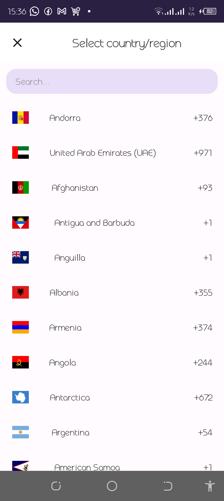
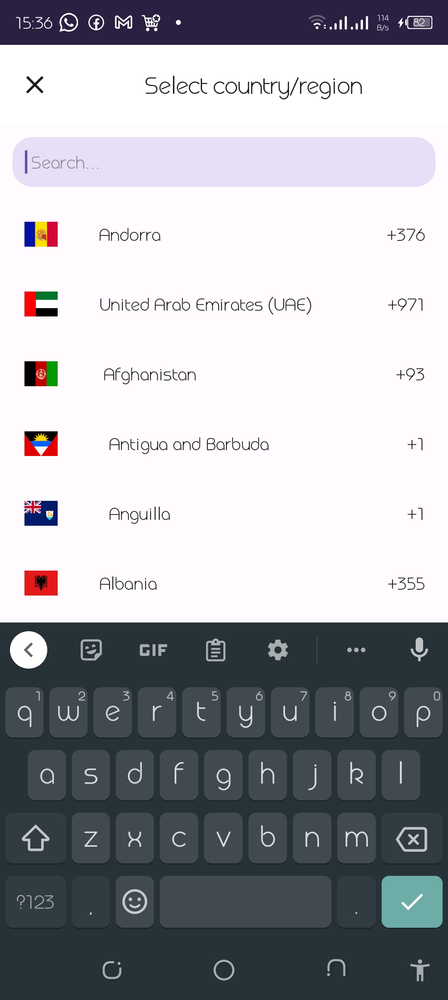
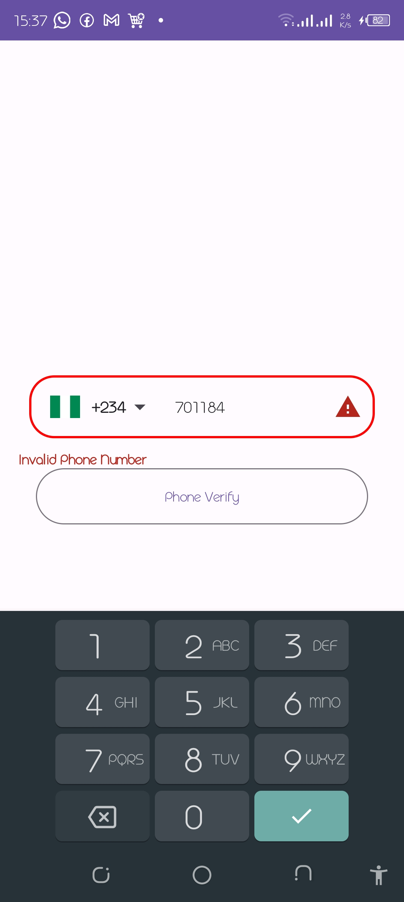
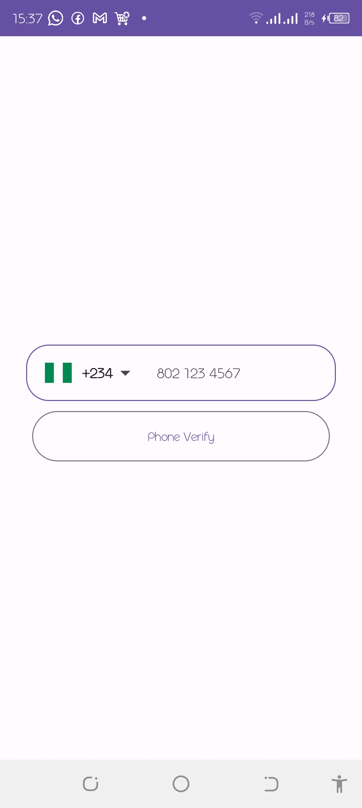
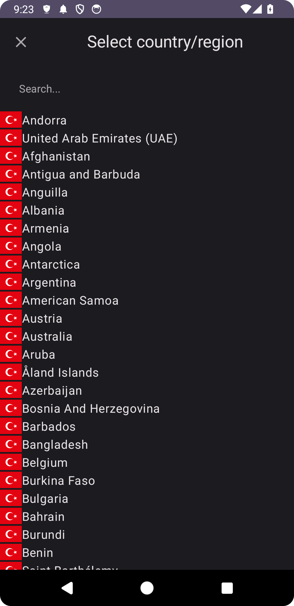

# XMaterial Compose Country Code Picker

Jetpack Compose Material Country Code Picker

<a href="https://www.linkedin.com/mwlite/in/tule-simon-67a202157">Chat me up on Linkedln</a>

## Latest Version [](https://jitpack.io/#TuleSimon/xMaterialccp)

The latest version is <a href="https://github.com/TuleSimon/xMaterialccp/releases/tag/v2.18">
2.18</a>

## WHAT IS NEW (2.18)

* **Fixed error arising with material icons being removed in new compose versions

# CREDIT

This project was forked
from <a href="https://github.com/togisoft/jetpack_compose_country_code_picker">togisoft</a>,
His Github repo and efforts are what laid the ground work for me to improve on it and create a more
customizable version of his library,


<h1>WELCOME</h1>

If you are looking for a highly customizable and Material Country Phone Code Picker for Jetpack
Compose you can use the package.

* Country numbers hints
* Phone number visualTransformation (Automatic number formatting)
* Automatic country recognition (detection by sim card if sim card is inserted)
* With TextField
* Can Customize
* Added language translations
* Added clear text button
* animations when searching
* Dialog changed and customized

Languages:

* Turkish
* English
* Italian
* Arabic
* Russian

New features will be added as time goes by and updates will be made. This project is open source
without any profit motive.

For language support, you can send me a message.
<a href="https://www.linkedin.com/mwlite/in/tule-simon-67a202157">Chat me up on Linkedln</a>

<h3>Screenshots</h3>
<div class="row">
   
   
   
  
 </div>


<h1> Specifications </h1>

<h3> Material Country Code Picker </h3>

```kotlin
@Composable
fun MaterialCountryCodePicker(
    text: String,
    onValueChange: (String) -> Unit,
    modifier: Modifier = Modifier,
    showCountryCode: Boolean = true,
    showCountryFlag: Boolean = true,
    defaultCountry: CountryData,
    pickedCountry: (CountryData) -> Unit,
    error: Boolean = false,
    showErrorText: Boolean = true,
    flagPadding: PaddingValues = PaddingValues(horizontal = 10.dp),
    countryItemBgShape: RoundedCornerShape = RoundedCornerShape(0.dp),
    phonenumbertextstyle: TextStyle = MaterialTheme.typography.bodyMedium,
    phonehintnumbertextstyle: TextStyle = MaterialTheme.typography.bodyMedium,
    searchFieldPlaceHolderTextStyle: TextStyle = MaterialTheme.typography.bodyMedium,
    searchFieldTextStyle: TextStyle = MaterialTheme.typography.bodyMedium,
    searchFieldShapeCornerRadiusInPercentage: Int = 30,
    textFieldShapeCornerRadiusInPercentage: Int = 30,
    errorTextStyle: TextStyle = MaterialTheme.typography.bodyMedium,
    appbartitleStyle: TextStyle = MaterialTheme.typography.titleLarge,
    countryItemVerticalPadding: Dp = 8.dp,
    countryItemHorizontalPadding: Dp = 8.dp,
    countrytextstyle: TextStyle = MaterialTheme.typography.bodyMedium,
    dialogcountrycodetextstyle: TextStyle = MaterialTheme.typography.bodyMedium,
    showCountryCodeInDIalog: Boolean = true,
    countrycodetextstyle: TextStyle = MaterialTheme.typography.bodyMedium,
    showDropDownAfterFlag: Boolean = false,
    isEnabled: Boolean = true,
    flagShape: CornerBasedShape = RoundedCornerShape(0.dp),
    isReadOnly: Boolean = false,
    @DrawableRes errorIcon: Int? = null,
    @DrawableRes dropDownIcon: Int? = null,
    showClearIcon: Boolean = false,
    @DrawableRes clearIcon: Int? = null,
    colors: CCPColors,
    onDone: () -> Unit = {},
    placeholder: @Composable () -> Unit? = null,
)
```  

<h3>  Field Usage </h3>

```kotlin
@Composable
fun SelectCountryWithCountryCode() {
    val context = LocalContext.current
    var phoneCode by remember { mutableStateOf(getDefaultPhoneCode(context)) }
    val phoneNumber = rememberSaveable { mutableStateOf("") }
    var defaultLang by rememberSaveable { mutableStateOf(getDefaultLangCode(context)) }
    var isValidPhone by remember { mutableStateOf(true) }
    Column(
        modifier = Modifier.padding(16.dp)
    ) {

        MaterialCountryCodePicker(
            pickedCountry = {
                phoneCode = it.countryPhoneCode
                defaultLang = it.countryCode
            },
            defaultCountry = getLibCountries().single { it.countryCode == defaultLang },
            error = !isValidPhone,
            text = phoneNumber.value,
            onValueChange = { phoneNumber.value = it },
            searchFieldPlaceHolderTextStyle = MaterialTheme.typography.bodyMedium,
            searchFieldTextStyle = MaterialTheme.typography.bodyMedium,
            phonenumbertextstyle = MaterialTheme.typography.bodyMedium,
            countrytextstyle = MaterialTheme.typography.bodyMedium,
            countrycodetextstyle = MaterialTheme.typography.bodyMedium,
            showErrorText = true,
            showCountryCodeInDIalog = true,
            showDropDownAfterFlag = true,
            textFieldShapeCornerRadiusInPercentage = 40,
            searchFieldShapeCornerRadiusInPercentage = 40,
            appbartitleStyle = MaterialTheme.typography.titleLarge,
            countryItemBgShape = RoundedCornerShape(5.dp),
            showCountryFlag = true,
            showCountryCode = true,
            isEnabled = true,
            colors = ccpDefaultColors(
                primaryColor = MaterialTheme.colorScheme.primary,
                errorColor = MaterialTheme.colorScheme.error,
                backgroundColor = MaterialTheme.colorScheme.background,
                surfaceColor = MaterialTheme.colorScheme.surface,
                outlineColor = MaterialTheme.colorScheme.outline,
                disabledOutlineColor = MaterialTheme.colorScheme.outline.copy(0.1f),
                unfocusedOutlineColor = MaterialTheme.colorScheme.onBackground.copy(0.3f),
                textColor = MaterialTheme.colorScheme.onBackground.copy(0.7f),
                cursorColor = MaterialTheme.colorScheme.primary,
                topAppBarColor = MaterialTheme.colorScheme.surface,
                countryItemBgColor = MaterialTheme.colorScheme.surface,
                searchFieldBgColor = MaterialTheme.colorScheme.surface,
                dialogNavIconColor = MaterialTheme.colorScheme.onBackground.copy(0.7f),
                dropDownIconTint = MaterialTheme.colorScheme.onBackground.copy(0.7f)

            )
        )

        val fullPhoneNumber = "$phoneCode${phoneNumber.value}"
        val checkPhoneNumber = checkPhoneNumber(
            phone = phoneNumber.value,
            fullPhoneNumber = fullPhoneNumber,
            countryCode = defaultLang
        )
        OutlinedButton(
            onClick = {
                isValidPhone = checkPhoneNumber
            },
            modifier = Modifier
                .fillMaxWidth()
                .padding(horizontal = 16.dp)
                .height(
                    50.dp
                )
        ) {
            Text(text = "Phone Verify")
        }
    }
}


```  

<h3> Extras </h3>

* <b> countrytextstyle </b> the textstyle to be used for the country in the lazy column in dialog
* <b> dialogcountrycodetextstyle </b> the textstyle to be used for the country code in the lazy
  column in dialog
* <b> showCountryCodeInDIalog </b> whether to show the country code in the lazy column dialog or not
* <b> countrycodetextstyle </b> the textstyle to be used for the country code in the original
  textfield
* <b> showDropDownAfterFlag </b> whether to show the drop down before or after the flag, if true then
  the dropdown will show after flag, if false before flag
* <b> dropDownIconTInt </b> the icon tint to be used for the dropdown icon
* <b> text </b> the dialog phone number text
* <b> onValueChange </b> the function to be called whenever the phone number changes
* <b> showCountryCode </b> If the country code should be shown on the textfield, if `false`
  and [showCountryFlag] is `true` just the flag will be shown
* <b> showCountryFlag </b>
* <b> defaultCountry </b> The default country to be showed when the ccp is first initialized without
  any selection
* <b> pickedCountry </b> the function to be called whenever a country is selected with a parameter
  of [CountryData] that sets the select country data to the parameter passed
* <b> error </b> if to switch textfield to error state, if `true` the textfield shows red outlines
  and an error icon
* showErrorText if to show an errortext that appears below the textfield when an error occurs
* flagPadding the padding values on the textfield
* countryItemBgShape The shape to be used for a row in the lazy column
* phonenumbertextstyle the textstyle for the phone number on the textfield
* phonehintnumbertextstyle the textstyle for the phone number hint on the textfield
* searchFieldPlaceHolderTextStyle the placeholder on the searchfield text style
* searchFieldTextStyle the search textfield text style
* errorTextStyle the style to be used for the error text
* appbartitleStyle the style to be used for the title on the appbar
* searchFieldShapeCornerRadiusInPercentage the searchfield shape corner radius
* textFieldShapeCornerRadiusInPercentage the textfield shape corner radius
* countryItemVerticalPadding the vertical padding for the country item on the lazy column
* countryItemHorizontalPadding the horizontal padding for the country item on the lazy column
* isEnabled to make the cccp to be enabled or disabled, if disabled the ccp can not be edited
* isReadOnly to make the cccp to be readonly, if readonly ccp can not be edited
* @DrawableRes errorIcon the icon to show if error occurs ,
* @DrawableRes dropDownIcon the icon for drop down ,
* showErrorIcon if to show icon if an errror occurs,
* flagShape to customize the shape of the flag
* <b> colors </b> customized the colors of the picker

<h3> Using the Builder </h3>
<h4>You can use the <b>dialogItemBuilder</b> to customize how the country items appear on the dialog</h4>
<h4>Here is an example</h4>

```kotlin
      MaterialCountryCodePicker(
    pickedCountry = {
        phoneCode = it.countryPhoneCode
        defaultLang = it.countryCode
    },
    defaultCountry = getLibCountries().single { it.countryCode == defaultLang },
    error = !isValidPhone,
    text = phoneNumber.value,
    onValueChange = { phoneNumber.value = it },
    dialogItemBuilder = { country, onclick ->

        Row(Modifier.clickable {
            onclick()
        }) {
            Image(
                painterResource(
                    id = getFlags(
                        country.countryCode
                    )
                ), contentDescription = null
            )
            Text(text = country.cNames)
        }

    }
)
```

<div class="row">
   
 </div>


<h3>Change picker Locale</h3>
You can now change just the picker Locale to your local by passing the language code

```kotlin
LaunchedEffect(key1 = true) {
    setLocale(context, "en")
}
```

<h3> How to add in your project </h3>

In the build.gradle add maven central repository

```groovy
    repositories {
    maven { url 'https://jitpack.io' }
}

```

Step 2. Add the dependency

```groovy
  dependencies {
    implementation 'com.github.TuleSimon:xMaterialccp:2.18'
}  
```    

<h3> Addition of new Features or Bug Request </h3>

Feel free to contact me for any feature request or file an issue if a bug is encountered 
